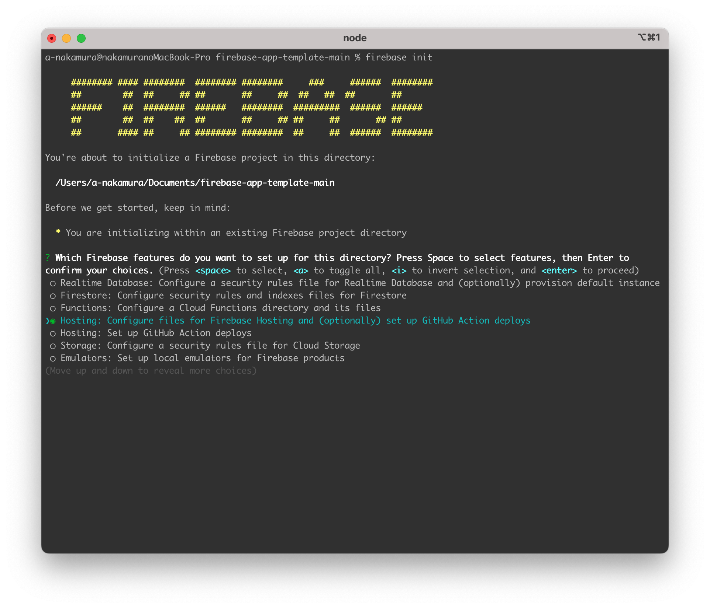

# firebase-app-template

Firebase 環境で動作する Web アプリ（HTML/CSS/JavaScript）のサンプル

## 前提条件

- Node.js と npm のインストール
  - インストールされていない場合は、公式サイトからダウンロードしてインストールしてください。
- Firebase CLI のインストール
  - ターミナルまたはコマンドプロンプトで以下のコマンドを実行してください。
    ```
    npm install -g firebase-tools
    ```

## 環境構築

1. Firebase プロジェクトを作成する
   1. ブラウザから Firebase コンソールにアクセスして、新しいプロジェクトを作成します。
1. ローカルのプロジェクトと Firebase プロジェクトを紐づける

   1. `public/app.js` の Firebase の設定を上書きします。
      ```js public/app.js
      // Firebaseの設定
      const firebaseConfig = {
        apiKey: "YOUR_API_KEY",
        authDomain: "YOUR_PROJECT_ID.firebaseapp.com",
        projectId: "YOUR_PROJECT_ID",
        storageBucket: "YOUR_PROJECT_ID.appspot.com",
        messagingSenderId: "YOUR_SENDER_ID",
        appId: "YOUR_APP_ID",
      };
      ```
   1. 以下のコマンドを実行して Firebase プロジェクトを選択して紐付けます。

      ```
      firebase init
      ```

      1. 表示された選択肢の中から `Hosting` にカーソルを合わせて Select キーを押します。マークがついたら Enter キーを押します。
         
      1. その後の質問に対しては以下の画像のように回答することで設定完了です。

         - `Do you want to use a web framework? (experimental)` => `No`
         - `What do you want to use as your public directory?` => `public`
         - `Configure as a single-page app (rewrite all urls to /index.html)?` => `Yes`
         - `Set up automatic builds and deploys with GitHub?` => `No`
         - `File public/index.html already exists. Overwrite?` => `No`
           

1. Firebase 設定ファイルを編集する
   1. firebase-app-template ディレクトリの直下に `.firebaserc` ファイルを作成してください。
   1. 内容は以下の通りで、`your-firebase-project-id` を Firebase プロジェクトの ID に置換してください。
      ```json
      {
        "projects": {
          "default": "your-firebase-project-id"
        }
      }
      ```
1. ローカル環境でアプリを動かす
   1. 以下のコマンドを実行することで Firebase Emulator を起動することができます。
      ```
      firebase emulators:start
      ```
   1. `http://localhost:5000`からローカル環境で起動したアプリにアクセスすることができます。

## Firebase へのデプロイ

以下のコマンドを実行すると Firebase Hosting に Web アプリをデプロイすることができます。

```
firebase deploy
```

デプロイが完了すると Firebase Hosting の URL が表示されます。この URL から公開されたアプリにアクセスすることができます。
